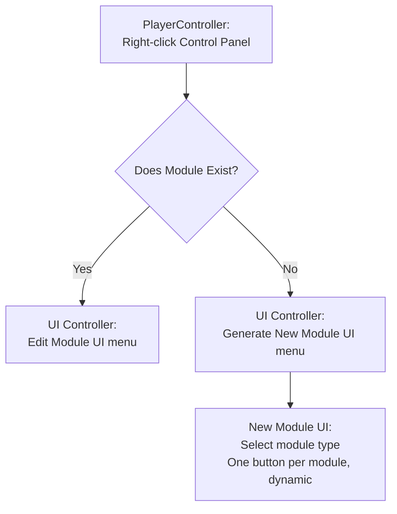
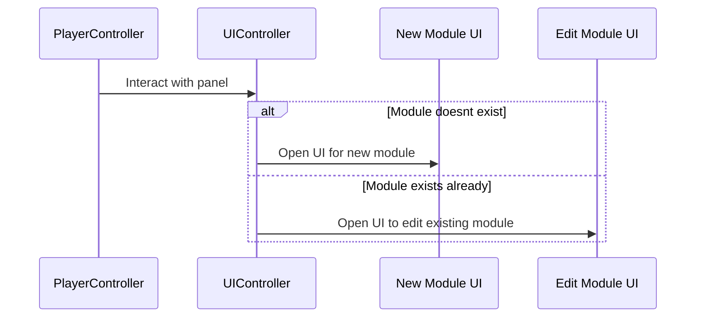

```mermaid
graph TD

start["PlayerController:
Right-click Control Panel"] --> doesModuleExist{Does Module Exist?}
doesModuleExist-->|Yes|editModule["UI Controller:
Edit Module UI menu"]
doesModuleExist-->|No|newModule["UI Controller:
Generate New Module UI menu"]

newModule-->newModuleUI["New Module UI:
Select module type
One button per module, dynamic"]
```

```mermaid
sequenceDiagram
	participant PlayerController
	participant UIController
	participant New Module UI
	participant Edit Module UI

PlayerController->>UIController: Interact with panel
alt Module doesnt exist
UIController->>New Module UI: Open UI for new module
else Module exists already
UIController->>Edit Module UI: Open UI to edit existing module
end
```
